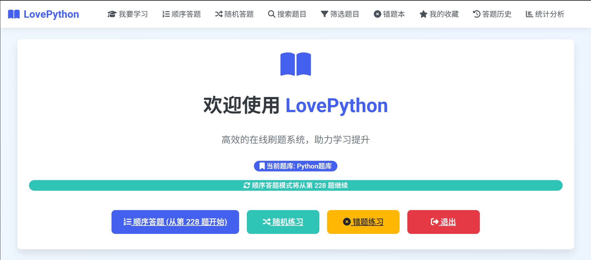
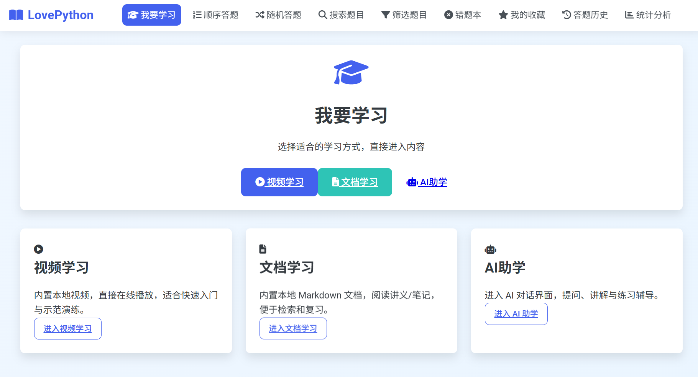

# LovePython


一款专为 **Python 学习**设计的全平台在线刷题系统，基于 **Flask** 实现，现已支持 **Web端** 和 **Android移动端**。提供从题库管理、用户注册登录，到随机出题、顺序答题、定时模式、模拟考试，以及视频学习、文档学习、AI助学等多种功能，帮助 Python 学习者随时随地高效提升编程能力。

## 🌟 功能特性

### 📱 多平台支持
- **Web端**: 现代化响应式设计，支持桌面和移动浏览器
- **Android端**: 原生Android应用，流畅的移动体验
- **同步数据**: 跨平台数据同步，随时切换设备继续学习

### 📝 用户管理
- **注册与登录**: 安全的用户账户创建与登录系统
- **个人数据跟踪**: 自动保存学习进度与题目记录
- **智能续答**: 系统记忆答题进度，无缝继续学习

### 📚 题库管理
- **CSV导入题库**: 便捷的题库导入功能
- **多种题型支持**: 单选题、多选题、判断题、填空题等
- **分类与难度系统**: 按类别和难度对题目进行组织
- **题目浏览**: 分页浏览所有题目，支持快速定位

### 📋 答题模式
- **随机答题**: 快速练习，从题库随机抽题
- **顺序答题**: 从上次停止的位置开始，系统实时记录进度，保证下次访问时能无缝继续
- **错题本**: 专注复习做错的题目，针对性提升
- **定时模式**: 在规定时间内完成题目，提高效率
- **模拟考试**: 模拟真实考试环境，一次性提交所有答案

### 🎓 学习资源
- **视频学习**: 内置本地视频资源，支持在线播放学习
- **文档学习**: 内置 Markdown 文档，支持在线阅读和下载
- **AI助学**: 智能对话助手，随时解答 Python 学习问题

### 🔍 查找与筛选
- **关键词搜索**: 通过题干内容或题号快速查找题目
- **智能筛选**: 按题型、类别、难度等条件筛选题目
- **全站搜索**: 支持跨页面搜索，不限于当前页面
- **筛选芯片**: 移动端友好的筛选界面，一键切换题型

### 🔖 个性化学习
- **收藏与标记**: 将重要题目加入收藏夹，添加个性化标记
- **答题历史**: 完整记录所有已答题目及正确情况
- **统计分析**: 详细的答题统计，包括正确率、难度分布和学习进度
- **学习轨迹**: 追踪学习路径，了解知识掌握情况

## 💻 技术栈

### Web端
- **后端**: Python + Flask
- **数据库**: SQLite
- **前端**: HTML/CSS + JavaScript + Jinja2模板引擎
- **UI框架**: Bootstrap工具类 + 自定义CSS
- **数据格式**: CSV导入题库、JSON存储选项

### Android端
- **开发语言**: Kotlin
- **UI框架**: Jetpack Compose
- **架构模式**: MVVM + Repository Pattern
- **数据库**: Room (SQLite)
- **网络请求**: Retrofit + OkHttp

## 🚀 快速开始

### Web端部署

1. **克隆仓库**
   ```bash
   git clone https://github.com/yunyunfanfan/EXAM-MASTER.git
   cd EXAM-MASTER
   ```

2. **安装依赖**
   ```bash
   pip install -r requirements.txt
   ```

3. **准备学习资源**（可选）
   - 将视频文件放入 `static/videos/` 目录
   - 将 Markdown 文档放入 `static/docs/` 目录

4. **启动应用**
   ```bash
   python app.py
   ```
   应用将在 http://localhost:32220 上运行

### Android端安装

1. **直接下载APK**
   - 访问项目首页或[Releases页面](https://github.com/yunyunfanfan/EXAM-MASTER/releases)
   - 下载最新版本 APK 文件
   
2. **安装说明**
   - 允许"未知来源"应用安装
   - 安装后输入Web端相同的服务器地址即可同步数据

3. **本地编译**（可选）
   ```bash
   cd ExamMasterAndroid
   ./gradlew assembleDebug
   ```

### 题库格式

题库使用CSV格式，包含以下字段：
- 题号: 题目唯一标识
- 题干: 题目内容
- A, B, C, D, E: 选项（可选）
- 答案: 正确答案，如"A"或"ABCD"（多选）
- 难度: 题目难度级别
- 题型: 如"单选题"、"多选题"等
- 类别: 题目所属类别（可选）

## 📖 使用指南

### 基本操作

1. **注册/登录**: 首次使用需注册账号，之后直接登录
2. **导航菜单**: 页面顶部提供多种功能入口
3. **答题流程**: 
   - 选择答题模式（随机/顺序/错题等）
   - 选择答案后提交
   - 系统自动判断正确性并记录

### 学习功能

- **我要学习**: 进入学习中心，选择视频学习、文档学习或AI助学
- **视频学习**: 浏览并播放内置的 Python 学习视频
- **文档学习**: 在线阅读或下载 Python 学习文档
- **AI助学**: 与AI助手对话，解答 Python 相关问题

### 其他功能

- **搜索题目**: 在"搜索题目"页面输入关键词
- **收藏题目**: 在答题页面点击"收藏"按钮，在"我的收藏"中查看
- **顺序刷题**: 系统实时记录进度，随时退出后下次访问将自动从上次答题位置继续
- **统计分析**: 在"统计与反馈"页面查看个人学习数据

## 🔄 最近更新

### v3.1 - 学习功能增强 (2025-12)
- **🎓 学习中心**: 新增"我要学习"入口，整合学习资源
- **📹 视频学习**: 支持本地视频在线播放功能
- **📄 文档学习**: 支持 Markdown 文档在线阅读和下载
- **🤖 AI助学**: 新增AI对话界面，提供智能学习助手
- **🎨 品牌更新**: 项目更名为 LovePython，专注 Python 学习

### v3.0 - Android端正式发布 (2025-05)
- **🎉 Android应用上线**: 原生Android应用正式发布，支持离线使用
- **📱 移动端优化**: 完全重写移动端浏览题目UI，现代化卡片设计
- **🔍 全站搜索**: 搜索和筛选功能从前端改为后端实现，支持跨页面操作
- **🛠 UI修复**: 修复电脑端布局串位问题，完善CSS工具类定义
- **🎯 筛选增强**: 修复移动端筛选芯片显示问题，正确显示所有题型

### v2.1 - Web端功能完善 (2025-05)
- **🔧 顺序答题优化**: 智能记忆答题进度，从上次停止位置继续
- **📊 统计功能增强**: 更详细的学习数据分析和可视化
- **🎨 响应式优化**: 改进移动端浏览体验和交互设计

## 📊 项目截图





## 🛠 开发者信息

- **作者**: yunyunfanfan
- **联系方式**: [zhjunjian2024@lzu.edu.cn](mailto:zhjunjian2024@lzu.edu.cn)
- **项目主页**: [GitHub](https://github.com/yunyunfanfan)
- **知乎**: [作者的知乎账号](https://www.zhihu.com/people/zhang-yun-jian-72-65)

---

欢迎提交Issue或Pull Request，共同完善本系统！
